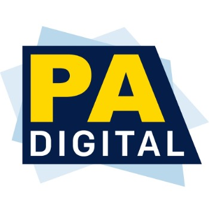

<link type="text/css" rel="stylesheet" href="main.css" />

# PA Digital Metadata Application Profile and Guidelines, Version 2.1 (MONTH 2021)

### Requirements, Recommendations, and Best Practices for Preparing Metadata for PA Digital’s DPLA Aggregator
 

# History and Acknowledgements
The PA Digital Metadata Team develops and maintains these guidelines, which were initially drafted in 2015 and first published in 2016. They are reviewed and updated annually. Group members have included:

* Rachel Appel, Formerly Temple University
* Linda Ballinger, Penn State
* Doreva Belfiore, Formerly HSLC
* Anastasia Chiu, Formerly Temple University
* Will Echevarria, Free Library of Philadelphia
* Bill Fee, State Library of Pennsylvania
* Leanne Finnigan, Temple University
* Gabe Galson, Temple University
* Eileen Kocher, State Library of Pennsylvania
* Alison Oskam, State Library of Pennsylvania
* Stefanie Ramsay, Formerly Temple University
* Katy Rawdon, Temple University
* Matthew Strauss, Detre Library and Archives, Heinz History Center
* Holly Tomren, Temple University
* Elise Warshavsky, Formerly Temple University
* Kristen Yarmey, Formerly University of Scranton

Between 2015 and 2021, this project was funded in part by a grant from the Institute of Museum and Library Services as administered by the Pennsylvania Department of Education through the Office of Commonwealth Libraries, and the Commonwealth of Pennsylvania, Tom Wolf, Governor.

Questions or comments on these guidelines are welcome and may be sent to [info@padigital.org](mailto:info@padigital.org).

 

# Table of Contents

TOC (sidebar preferred)

 

# Introduction

These guidelines are meant to assist contributing institutions as they plan metadata creation for digital projects. They also serve as an assessment tool for legacy collections and remediation planning. We recognize that contributing shareable metadata takes time and resources. To support our partners, the PA Digital Metadata Team provides consultation services on description, remediation, and rights assessment during the onboarding process and beyond. To inquire about these services, please contact [info@padigital.org](mailto:info@padigital.org).

Potential contributors should review PA Digital’s [Readiness Checklist](https://padigital.org/pa-digital-readiness/) in addition to these guidelines. Adhering to these guidelines makes the onboarding process much easier, TPlease note that although the onboarding process is made easier by the adherence to these guidelines, but PA Digital is able to accommodate institutions whose metadata do not conform to the mapping recommendations outlined here as long as use is consistent. we are able to accommodate institutions whose metadata do not conform to the mapping recommendations outlined herebelow.

Our aggregation software usesis based on the [Open Archives Initiative’s Protocol for Metadata Harvesting](https://www.openarchives.org/OAI/openarchivesprotocol.html) (OAI-PMH) and on the [Dublin Core metadata terms](http://dublincore.org/documents/dcmi-terms/). The following best practices apply to metadata contributed to PA Digital generally:

* We recommend the use of qualified Dublin Core elements whenever possible. If your repository does not support the use of qualified Dublin Core, use the matching simple Dublin Core element recommended in these guidelines.
* Unless otherwise specified, metadata should describe the **_original resource_**, not its digital representation.
* Common delimiting characters such as pipes (" | ") and semicolons (" ; ") should be avoided; unless otherwise specified, PA Digital uses semicolons to delimit fields with multiple values.
* URIs that communicate rights held over the digitized resource, such as those from rightsstatements.org and creativecommons.org, are preferred; textual rights statements are acceptable.When using URIs, they should be added in addition to string values, not in place of them.

We also accept metadata in MODS or MARC in XML, as well as in consistently structured, delimited text files (CSVs, TSVs, etc.).

Incoming metadata are normalized and mapped using Extensible Stylesheet Language Transformations (XSLT) scripts, which are maintained and located here: https://github.com/tulibraries/aggregator_mdx

 

# Shareable Metadata

Contributors to PA Digital should strive to provide shareable, quality metadata. In _[Best Practices for OAI Data Provider Implementations and Shareable Metadata](http://webservices.itcs.umich.edu/mediawiki/oaibp/index.php/ShareableMetadataPublic)_ (2007), the authors provide recommendations to assure that aggregated records retain meaning within a shared portal. The characteristics they describe are useful for contributors to PA Digital and DPLA.

* **Context.** Records within DPLA are removed from the context provided by local systems and users. Descriptions that make sense locally may not be ideal in a large, shared system such as DPLA. Quality, shareable metadata remain meaningful even in an aggregated environment removed from the originating repository.

* **Completeness.** Records in a shared system are most discoverable and meaningful when they are complete and robust. They should make sense standing on their own and they should be rich enough to enable discovery in a system with roughly 30 million records. Avoid the use of abbreviations or ambiguous references.

* **Consistency.** Syntax, elements, and vocabularies should be used consistently. This allows PA Digital and DPLA to more easily assess, prepare, and aggregate your metadata and provide discovery platforms that increase access to your valuable, contributed resources.

* **Controlled vocabularies.** The use of widely-adopted vocabularies helps to better integrate records from other contributing institutions.

In the spirit of shareable metadata, note that PA Digital and DPLA require that metadata (_but not digital content_) be licensed as [CC0](https://creativecommons.org/about/cc0) ("No rights reserved"). The following excerpt from _[The ­Digital Public Library of America Policy Statement on Metadata](https://pro.dp.la/hubs/metadata-application-profile)_ speaks to the importance of this policy in fulfilling DPLA’s mission and values: 

_<blockquote>"The DPLA aims to make the cultural and scientific record available, free of charge, to all through databases of metadata. The DPLA, for this purpose, has undertaken the task of ingesting, indexing, enriching, and making available descriptive metadata and wishes to make such metadata widely available for reuse._

_The DPLA wishes to promote innovation in the development of applications and tools that use and rely on this metadata. In order to foster such innovation, the DPLA is committed to ensuring such metadata is unencumbered by legal restrictions. This policy and statement on metadata contained in the DPLA’s databases reflects that commitment. To that same end, the DPLA believes this policy is in accord with the letter and spirit of United States copyright law and would be fully respected in a court of law._

_The DPLA hopes that the content and resources in the library will be put to creative uses that educate, inform, and empower current and future generations."</blockquote>_

 

# Wikimedia Commons Partnership

In 2019, DPLA [announced a partnership with the Wikimedia Foundation](https://dp.la/news/dpla-cultural-artifacts-coming-to-wikipedia-through-new-collaboration-with-wikimedia-foundation?mc_cid=ef55eb9c56), "to make artifacts from cultural heritage institutions more accessible to all." The partnership created a pipeline to add public domain objects from DPLA into the Wikimedia Foundation's various free knowledge services such as Wikipedia. 

Through this partnership, PA Digital contributors may share their public domain objects with Wikimedia Commons as part of our routine, quarterly harvests. Shared objects are openly available to Wikimedia users for reuse. This opt-in service can be configured by contacting [info@padigital.org](mailto:info@padigital.org).

 

# Quick Reference: Mapping Recommendations for Dublin Core

| PA Digital Label | PA Digital Status | Qualified DC Element | Simple DC Element |
|--|--|--|--|
| Alternative Title | Optional | dcterms:alternative |  |
| Contributor | Optional | dcterms:contributor | dc:contributor |
| Collection Name | Required or Derived* | dcterms:isPartOf |  |
| Contributing Institution | Derived |  |  |
| Creator | Recommended | dcterms:creator | dc:creator |
| Date | Recommended | dcterms:created | dc:date |
| Description | Recommended | dcterms:description | dc:description |
| Extent | Optional | dcterms:extent |  |
| File Format | Optional | dcterms:format | dc:format |
| Format | Recommended | dcterms:type | dc:type |
| Identifier | Optional | dcterms:identifier | dc:identifier |
| IIIF Base URL | Optional or Derived* | dcterms:identifier |  |
| IIIF Manifest | Optional or Derived* | dcterms:isReferencedBy |  |
| Intermediate Provider | Derived |  |  |
| URL | Required or Derived* | dcterms:identifier | dc:identifier |
| Language | Recommended for textual and spoken material | dcterms:language | dc:language |
| Media Master | Optional or Derived* |  |  |
| Place | Recommended | dcterms:spatial | dc:coverage |
| Preview | Strongly recommended or Derived* | dcterms:identifier | dc:identifier |
| Publisher | Optional | dcterms:publisher | dc:publisher |
| Relation | Optional | dcterms:relation | dc:relation |
| Replaced By | Optional | dcterms:isReplacedBy |  |
| Replaces | Optional | dcterms:replaces |  |
| Rights | Required (or Rights URI) | dcterms:rights | dc:rights |
| Rights Holder | Optional | dcterms:rightsholder |  |
| Source | Optional | dcterms:source | dc:source |
| Rights URI | Required (or Rights) | dcterms:rights | dc:rights |
| Subject | Recommended | dcterms:subject | dc:subject |
| Temporal Coverage | Optional | dcterms:temporal | dc:subject |
| Title | Required | dcterms:title | dc:title |
| Type | Recommended | dcterms:type | dc:type |

*_Values for some fields may be derived from metadata elsewhere in the record. For example, an object or thumbnail URL may be derived from a consistently formatted identifier present in the record, or a collection name may be derived from the setSpec value in the OAI-PMH output._

 

# Guidelines Key

Fields are arranged alphabetically by PA Digital label. Descriptors with no content are omitted. 

| **PA Digital Label** | Field label used by PA Digital |
|--|--|
| **Status** | Identifies whether a field is required, strongly recommended, recommended, optional, or derived |
| **Description** | A description of the field |
| **Qualified DC Element** | The qualified Dublin Core term to which a field should map |
| **Simple DC Element** | The simple Dublin Core element to which a field should map if qualified term is unavailable 
| **CONTENTdm Mapping** | The DC Map value in Field properties |
| **CSV Header** | Recommended header value for delimited text files |
| **Repeatable** | Whether a field may be repeated |
| **CV/Syntax** | Recommended controlled vocabularies or syntax |
| **Notes and Best Practices** | Includes recommendations for a field’s content, application, and punctuation |
| **Examples** | Examples that illustrate best practices |

 

# Fields
| PA Digital Label | Alternative Title |
|--|--|
| **Status** | Optional |
| **Description** | Any alternative title of the described resource including abbreviations and translations |
| **Qualified DC Element** | dcterms:alternative |
| **CONTENTdm Mapping** | Title-Alternative |
| **CSV Header** | Alternative_Title |
| **Repeatable** | Yes |
| **CV/Syntax** | Natural language |
| **Notes and Best Practices** | {::nomarkdown}<ul><li>Comparable to MARC variations of titles (such as alternative spellings)</li><li>May also be used for translations of titles in foreign languages</li><li>Avoid use of explanatory or qualifying symbols (e.g., brackets)</li><li>Where there are multiple Title fields, any instance after the first will map to Alternative Title</li></ul>{:/} |

 

| PA Digital Label | Collection Name |
|--|--|
| **Status** | Derived (or Required, see below) |
| **Description** | Collection or aggregation of which described resource is a part |
| **Qualified DC Element** | dcterms:isPartOf |
| **CONTENTdm Mapping** | Relation-Is Part Of |
| **CSV Header** | Collection_Name |
| **Repeatable** | Yes |
| **Notes and Best Practices** | <ul><li>Whenever possible, PA Digital will use the setSpec, or collection identifier, value in the OAI-PMH output to generate a human-readable, normalized Collection Name<li>SetSpec values must be valid; see the pattern requirements under setSpecType in the [OAI-PMH specifications](http://www.openarchives.org/OAI/2.0/OAI-PMH.xsd)<li>Institutions that wish to map collection names from their metadata rather than the setSpec should inform PA Digital during the onboarding process</li></ul> |

 

| PA Digital Label | Contributing Institution |
|--|--|
| **Status** | Derived or PA Digital supplied |
| **Description** | The organization that supplies metadata to PA Digital |
| **CSV Header** | Data_Provider |
| **Repeatable** | Yes |
| **Notes and Best Practices** | <ul><li>Values for this field may be mapped from consistently formatted metadata elsewhere in a record; examples include identifiers and object URLs<li>Values may also be supplied by PA Digital during the ingestion process. Institutions should specify during onboarding the desired value(s) for this field<li>Under certain circumstances, Contributing Institution values may be mapped from metadata; names should be normalized, consistent, and identifiable</li></ul> |

 

| PA Digital Label | Contributor |
|--|--|
| **Status** | Optional |
| **Description** | An entity responsible for making secondary contributions to the described resource. Examples of a Contributor include a person, an organization, or a service |
| **Qualified DC Element** | dcterms:contributor |
| **Simple DC Element** | dc:contributor | 
| **CONTENTdm Mapping** | Contributor |
| **CSV Header** | Contributor |
| **Repeatable** | Yes |
| **CV/Syntax** | <ul><li>Use standard vocabularies such as [LCNAF](http://id.loc.gov/), [VIAF](https://viaf.org/), or [ULAN](http://www.getty.edu/research/tools/vocabularies/ulan/) whenever possible; consistently applied local vocabularies are acceptable<li>If an authorized form is unavailable, use similar syntax (Lastname, Firstname, YYYY-YYYY)</li></ul> |
| **Notes and Best Practices** | <ul><li>Use a semicolon to separate multiple values<li>Avoid use of placeholder values (e.g., "Unknown")<li>For oral histories, Contributor is the interviewer<li>Use name only without indication of role except in cases where a person’s role is included in an authorized form. For example, prefer "Smith, John, 1880-1960" not "Smith, John, 1880-1960, publisher"</li></ul> |
| **Examples** | <ul><li>Beck, James M. (James Montgomery), 1861-1936<li>United States. Army Map Service</li></ul> |

 

| PA Digital Label | Creator |
|--|--|
| **Status** | Recommended |
| **Description** | An entity primarily responsible for making the described resource. Examples of a Creator include a person, an organization, or a service |
| **Qualified DC Element** | dcterms:creator |
| **Simple DC Element** | dc:creator | 
| **CONTENTdm Mapping** | Creator |
| **CSV Header** | Creator |
| **Repeatable** | Yes |
| **CV/Syntax** | <ul><li>Use standard vocabularies such as [LCNAF](http://id.loc.gov/), [VIAF](https://viaf.org/), or [ULAN](http://www.getty.edu/research/tools/vocabularies/ulan/) whenever possible; consistently applied local vocabularies are acceptable<li>If an authorized form is unavailable, use similar syntax (Lastname, Firstname, YYYY-YYYY)</li></ul> |
| **Notes and Best Practices** | <ul><li>Use a semicolon to separate multiple values<li>Avoid use of placeholder values (e.g., "Unknown")<li>For oral histories, Creator is the interviewee<li>Use name only without indication of role except in cases where a person’s role is included in an authorized form. For example, prefer "Smith, John, 1880-1960" not "Smith, John, 1880-1960, publisher"</li></ul> |
| **Examples** | <ul><li>Littell, Franklin H. (Franklin Hamlin), 1917-2009<li>Catholic Church. Archdiocese of Philadelphia (Pa.)</li></ul> |

 

| PA Digital Label | <a name="date"/>Date |
|--|--|
| **Status** | Recommended |
| **Description** | Date of creation of the described resource |
| **Qualified DC Element** | dcterms:date |
| **Simple DC Element** | dc:date | 
| **CONTENTdm Mapping** | Date |
| **CSV Header** | Date |
| **Repeatable** | Yes |
| **CV/Syntax** | <ul><li>Prefer use of [EDTF](https://www.loc.gov/standards/datetime/) for both known and uncertain dates<li>DPLA can parse many types and formats of dates. Please refer to their [Geographic and Temporal Guidelines](https://docs.google.com/document/d/1lfiJ8yoZf1fAoR5vmJoHpWQO63eKeL8HDGVupCocfoM/edit?usp=sharing) for examples |
| **Notes and Best Practices** | <ul><li>Avoid use of placeholder values (e.g., "Unknown", "n.d."). If a date is unknown, we encourage including an estimated date range or value compatible with EDTF. If an estimate cannot be made, leave the field blank<li>For guidance on dates or date ranges that reflect "aboutness" (for example, a memoir about the 1870s) please see [Temporal Coverage](#temporal)<li>Except where appropriate for born-digital objects, do not map dates of digitization or digital publication (as opposed to the creation of the original) to dcterms:date or dc:date. Institutions with QDC support may use alternate mappings such as dcterms:issued or dcterms:available. Institutions without QDC support should map only the date the item was created to dc:date</li></ul> |
| **Examples** | <ul><li>Known date</li><ul><li>1999</li><li>1999-05</li><li>1999-05-01</li></ul><li>Uncertain date</li><ul><li>1999?</li><li>199u</li><li>1999-05?</li><li>1999-05-01?</li></ul><li>Approximate date</li><ul><li>1999&#126;</li><li>1999-05&#126;</li><li>1999-05-01&#126;</li></ul><li>Date range</li><ul><li>1992/1995</li><li>1990-02-08/2017-03-09</li><li>1984/2004-06&#126;</li></ul><li>Acceptable non-EDTF values</li><ul><li>circa 1999</li><li>ca. 1999</li><li>approximately 1999</li><li>1992-1995</ul></ul> |

 

| PA Digital Label | <a name="description"/>Description |
|--|--|
| **Status** | Recommended |
| **Description** | A free text account of the described resource that succinctly captures its "aboutness" |
| **Qualified DC Element** | dcterms:description |
| **Simple DC Element** | dc:description | 
| **CONTENTdm Mapping** | Description |
| **CSV Header** | Description |
| **Repeatable** | Yes |
| **CV/Syntax** | Natural language; semicolons may be used as punctuation |
| **Notes and Best Practices** | <ul><li>Description at the object-level is highly preferred</li><li>Contributing institutions should consider the utility of the Description field in the DPLA portal as a rich source of keywords for discovery</li><li>Do not map fields with OCR or full-text transcription into the Description field</li><li>Revise potentially harmful content descriptions with more respectful terminology</li></ul> |
| **Examples** | <ul><li>Program dated February 14, 1943 for a lecture titled "This Year of Our Lord," given by Fordham University President Robert I. Gannon, S.J. at the Hotel Casey in Scranton, Pennsylvania. Gannon's lecture was part of the University of Scranton Lecture series. The program also advertises the next lecture in the series, a talk on "Christendom and the Coming Peace" by Fordham University professor Gerald Groveland Walsh, S.J. scheduled for March 14, 1943. 4 pages.</li><li>Mummer's Parade on New Year's Day. South Broad Street, South Philadelphia, PA.</li><li>Oral history recorded December 23, 1981 and May 20, 1982 in Newark, N.J. and Rochester, N.Y.</ul> |

 

| PA Digital Label | Extent |
|--|--|
| **Status** | Optional |
| **Description** | The size or duration of the described resource. Examples for print materials include number of pages, a specification of length, width, and breadth, or for audio-visual materials, a time period of duration in hours, minutes, and seconds |
| **Qualified DC Element** | dcterms:extent | 
| **CONTENTdm Mapping** | Format-Extent |
| **CSV Header** | Extent |
| **Repeatable** | Yes |
| **CV/Syntax** | Natural language; semicolons may be used as punctuation |
| **Notes and Best Practices** | <ul><li>Recommend use of a content standard such as [RDA](https://www.loc.gov/aba/rda/), [CCO](http://vraweb.org/resources/cataloging-cultural-objects/), or [DCRMS](http://rbms.info/dcrm/dcrms/) when applicable</li><li>Use a semicolon to separate multiple values</li></li>For dimensions, include units. Spell out abbreviations for maximum clarity</li><li>For video or sound recording run times, use HH:MM:SS format with leading zeros when necessary</li></ul> |
| **Examples** | <ul><li>4 7/8 x 8 3/16 inches</li><li>1 map on 13 sheets</li><li>00:14:21</li> |

 

| PA Digital Label | File Format |
|--|--|
| **Status** | Optional |
| **Description** | The file format of the digital object |
| **Qualified DC Element** | dcterms:format |
| **Simple DC Element** | dc:format | 
| **CONTENTdm Mapping** | Format |
| **CSV Header** | Format |
| **Repeatable** | Yes |
| **CV/Syntax** | Recommend use of [IANA Media Types](https://www.iana.org/assignments/media-types/media-types.xhtml) |
| **Notes and Best Practices** | <ul><li>Entries include a media type and subtype, separated with a slash</li><li>Use a semicolon to separate multiple values</li></ul> |
| **Examples** | <ul><li>application/pdf</li><li>audio/mpeg</li><li>image/jpeg</li><li>image/jp2</li><li>image/tiff</li><li>video/mpeg</li><li>video/mp4</li></ul> |

 

| PA Digital Label | <a name="format"/>Format |
|--|--|
| **Status** | Recommended |
| **Description** | Physical medium of the described resource |
| **Qualified DC Element** | dcterms:type |
| **Simple DC Element** | dc:type | 
| **CONTENTdm Mapping** | Type |
| **CSV Header** | Type |
| **Repeatable** | Yes |
| **CV/Syntax** | Use standard vocabularies such as [AAT](http://www.getty.edu/research/tools/vocabularies/aat) or [TGM](http://id.loc.gov/vocabulary/graphicMaterials); consistently applied local vocabularies are acceptable |
| **Notes and Best Practices** | <ul><li>Format is a more granular description of an object’s type than what is possible with the DCMI vocabulary used in the [Type](#type) field</li><li>Values in an incoming Type field not found in the DCMI Type vocabulary will map to Format in PA Digital and DPLA. Please see [Type](#type) for additional mappings from our Type field</li><li>Use a semicolon to separate multiple values</li></ul> |
| **Examples** | <ul><li>Fire insurance maps</li><li>Zines</li></ul> |

 

| PA Digital Label | Identifier |
|--|--|
| **Status** | Derived. PA Digital does not map local record identifiers, but generates its own based on metadata elsewhere in the record. Best practices indicated here are offered as a resource |
| **Description** | An unambiguous reference to the described resource within a given context |
| **Qualified DC Element** | dcterms:identifier |
| **Simple DC Element** | dc:identifier | 
| **CONTENTdm Mapping** | Identifier |
| **CSV Header** | Identifier |
| **Repeatable** | No |
| **CV/Syntax** | Recommend alphanumeric strings only with no spaces or special characters such as “ @ “, “ # “, “ $ “, " % “, “ &“, “ * “, “ ’ “, “ . “ |
| **Notes and Best Practices** | Recommended best practice is to uniquely identify the resource within an institution’s collections by means of a string conforming to a formal identification system |
| **Examples** | <ul><li>P441110B</li><li>HPHWPZ201404000165</li><li>1999-002_006</li></ul> |

 

| PA Digital Label | IIIF Base URL |
|--|--|
| **Status** | Optional or Derived |
| **Description** | The base URL required to access a IIIF service for the digital resource |
| **Qualified DC Element** | dcterms:identifier |
| **CSV Header** | IIIF_Base |
| **Repeatable** | No |
| **Notes and Best Practices** | <ul><li>Must resolve to a IIIF service</li><li>For institutions that do not supply IIIF information with their metadata, it may be derived from metadata elsewhere in the record. For example, a IIIF Base URL may be derived from the URL for the digital object</li></ul> |
| **Examples** | <ul><li>https://digital.library.temple.edu/digital/iiif/p245801coll0/4024/</li><li>https://media.philamuseum.org/image/JGJ_B008_F009_001_001/</li></ul> |

 

| PA Digital Label | IIIF Manifest |
|--|--|
| **Status** | Optional or Derived |
| **Description** | A URI for the manifest of a IIIF resource; may be used to support inclusion of objects in Wikimedia Commons |
| **Qualified DC Element** | dcterms:isReferencedBy |
| **CSV Header** | IIIF_Man |
| **Repeatable** | No |
| **Notes and Best Practices** | <ul><li>Must resolve to a IIIF manifest</li><li>For institutions that do not supply IIIF information with their metadata, it may be derived from metadata elsewhere in the record. For example, a IIIF Manifest URI may be derived from the URL for the digital object</li></ul> |
| **Examples** | <ul><li>https://digital.library.temple.edu/iiif/info/p245801coll0/4024/manifest.json</li><li>https://digital.library.villanova.edu/Item/vudl:92879/Manifest |

 

| PA Digital Label | Intermediate Provider |
|--|--|
| **Status** | Derived or PA Digital supplied |
| **Description** | An intermediate organization that selects, collates, curates, or provides a repository for data from a contributing institution or institutions that is then aggregated from a single point by PA Digital |
| **CSV Header** | Intermediate_Provider |
| **Repeatable** | No |
| **Notes and Best Practices** | <ul><li>Values for this field may be mapped from consistently formatted metadata elsewhere in the record; examples include identifiers and object URLs</li><li>Values may also be supplied by PA Digital during the ingestion process. Intermediate organizations should specify during onboarding the desired value for this field</li></ul> |
| **Examples** | <ul><li>POWER Library PA Photos and Documents</li><li>Historic Pittsburgh</li></ul> |

 

| PA Digital Label | Language |
|--|--|
| **Status** | Recommended for textual and spoken material |
| **Description** | Language expressed in a resource that contains text or speech |
| **Qualified DC Element** | dcterms:language |
| **Simple DC Element** | dc:language | 
| **CONTENTdm Mapping** | Language |
| **CSV Header** | Language |
| **Repeatable** | Yes |
| **CV/Syntax** | Use standard or consistently applied local vocabularies; [ISO 639-3](https://iso639-3.sil.org/code_tables/639/data ) is preferred |
| **Notes and Best Practices** | <ul><li>Use a semicolon to separate multiple values</li><li>Do not use for non-linguistic content such as images containing no text</li> |
| **Examples** | <ul><li>eng</li><li>fre</li><li>afr ; afu ; eng</li></ul> |

 

| PA Digital Label | Media Master |
|--|--|
| **Status** | Optional |
| **Description** | URL that points to a downloadable version of the digital object; used to support inclusion of non-IIIF media objects in Wikimedia Commons |
| **Qualified DC Element** | _See notes below_ |
| **CSV Header** | Media_Master |
| **Repeatable** | Yes |
| **Notes and Best Practices** | <ul><li>Please contact PA Digital metadata specialists before implementing this field</li>Must resolve to a downloadable version of the digital object; thumbnails that represent the digital object for the purposes of providing a preview are not acceptable</li><li>Records for compound, multipage objects such as books should include a URL to each file associated with the object. Where these are not available via the ingestion process, a CSV supplement may be supplied</li></ul> |
| **Examples** | https://archives.philamuseum.org/jgj/JCC_B043_F001_001/cat-0003 |

 

| PA Digital Label | <a name="place"/>Place |
|--|--|
| **Status** | Recommended |
| **Description** | Geographic location referenced or depicted by the described resource; captures its "aboutness" |
| **Qualified DC Element** | dcterms:spatial |
| **Simple DC Element** | dc:coverage | 
| **CONTENTdm Mapping** | Coverage-Spatial |
| **CSV Header** | Place |
| **Repeatable** | Yes |
| **CV/Syntax** | Use standard vocabularies such as [LCNAF](http://id.loc.gov/authorities/names.html), [TGN](http://www.getty.edu/vow/TGNSearchPage.jsp), [GeoNames](http://www.geonames.org/), or [FAST](http://fast.oclc.org/searchfast/) whenever possible; consistently applied local vocabularies are acceptable |
| **Notes and Best Practices** | <ul><li>Use a semicolon to separate multiple values</li><li>This field does not represent the physical location or address of the physical or digital repository where the original item or digital facsimile is held</li><li>Consistency when using hierarchical values is recommended (e.g., “Pittsburgh, Pennsylvania, United States of America”)</li><li>Addresses, latitude/longitude, or other forms of location markers may also be mapped to this field for the purposes of geolocation and/or digital mapping</li><li>For latitude/longitude, DPLA prefers latitude first, with the two coordinates separated by a comma, limited to whole numbers and decimals as opposed to degree-minutes-seconds (e.g., “6.703, 46.627”). If used, compass directions should appear after the number</li><li>See DPLA’s [Geographic and Temporal Guidelines](https://docs.google.com/document/d/1lfiJ8yoZf1fAoR5vmJoHpWQO63eKeL8HDGVupCocfoM/edit?usp=sharing) for more information</li></ul> |
| **Examples** | <ul><li>Pittsburgh (Pa.)</li><li>Allegheny County (Pa.)</li><li>Harrison (Allegheny County, Pa. : Township)</li><li>40.85N, 77.84W</li><li>40.85, -77.84</li></ul> |

 

| PA Digital Label | Preview |
|--|--|
| **Status** | Strongly recommended or Derived |
| **Description** | The URL of a thumbnail, extract, or other type of resource representing the digital object for the purposes of providing a preview |
| **Qualified DC Element** | dcterms:identifier |
| **Simple DC Element** | dc:identifier | 
| **CSV Header** | Preview |
| **Repeatable** | No |
| **Notes and Best Practices** | <ul><li>The URL must resolve to a preview of the digital object</li><li>Values for this field may be mapped from consistently formatted metadata elsewhere in the record</li></ul> |
| **Examples** | http://historicpittsburgh.org/islandora/object/pitt%3A715.164812.CP/datastream/TN/view/Roadway.jpg |

 

| PA Digital Label | Publisher |
|--|--|
| **Status** | Optional |
| **Description** | An entity responsible for making the described, original resource available. Typically, this is a publishing house, a corporate body, a government agency, a university, or other organization |
| **Qualified DC Element** | dcterms:publisher |
| **Simple DC Element** | dc:publisher | 
| **CONTENTdm Mapping** | Publisher |
| **CSV Header** | Publisher |
| **Repeatable** | Yes |
| **CV/Syntax** | <ul><li>Use standard vocabularies such as [LCNAF](http://id.loc.gov/) or [VIAF](https://viaf.org/) whenever possible; consistently applied local vocabularies are acceptable</li><li>If an authorized form is unavailable, use similar syntax; semicolons may be used as punctuation</li></ul> |
| **Notes and Best Practices** | <ul></li>Use this field for published materials such as books, magazines, and journals</li><li>Use a semicolon to separate multiple values</li><li>Avoid use of placeholder values (e.g., “Unknown”, “s.n.”); leave the field blank if a publisher cannot be accurately determined or if there is no publisher</li><li>Avoid use of qualifying terms except in cases where a role is included in the authorized form. For example, prefer “Rand McNally and Company” not “Rand McNally and Company, publisher”</li><li>Not to be used for the entity responsible for digitizing or making the digital representation available</li></ul> |
| **Examples** | <ul><li>Rand McNally and Company</li><li>Philadelphia Evening Bulletin</li></ul> |

 

| PA Digital Label | Relation |
|--|--|
| **Status** | Optional |
| **Description** | A related resource, such as the name of a collection, series, or group of thematic works. May be suitable for items that are part of an archival collection |
| **Qualified DC Element** | dcterms:relation |
| **Simple DC Element** | dc:relation | 
| **CONTENTdm Mapping** | Relation |
| **CSV Header** | Relation |
| **Repeatable** | Yes |
| **CV/Syntax** | Natural language; semicolons may be used as punctuation |
| **Examples** | <ul><li>George D. McDowell Philadelphia Evening Bulletin Collection</li><li>The Zaner-Bloser, Inc. / Sonya Bloser Monroe Collection</li></ul> |

 

| PA Digital Label | Replaced By |
|--|--|
| **Status** | Optional |
| **Description** | A related resource that supplants, displaces, or supersedes the described resource |
| **Qualified DC Element** | dcterms:isReplacedBy |
| **CONTENTdm Mapping** | Relation-Is Replaced By |
| **CSV Header** | Replaced_By |
| **Repeatable** | Yes |
| **CV/Syntax** | Natural language |
| **Notes and Best Practices** | This field is intended for series and title changes, for example government documents or serial publications and periodicals |
| **Examples** | <ul><li>Federal Highway Administration Office of Motor Carrier and Highway Safety Register</li><li>Grants for Foreign and International Programs</li></ul> |

 

| PA Digital Label | Replaces |
|--|--|
| **Status** | Optional |
| **Description** | A related resource that is supplanted, displaced, or superseded by the described resource |
| **Qualified DC Element** | dcterms:replaces |
| **CONTENTdm Mapping** | Relation-Replaces |
| **CSV Header** | Replaces |
| **Repeatable** | Yes |
| **CV/Syntax** | Natural language |
| **Notes and Best Practices** | This field is intended for series and title changes, for example government documents or serial publications and periodicals |
| **Examples** | <ul><li>Federal Highway Administration Office of Motor Carriers Register</li><li>Grants for International and Foreign Programs</li></ul> |

 

| PA Digital Label | <a name="rights"/>Rights |
|--|--|
| **Status** | A rights statement is required. This can be a uniform resource identifier (URI) from RightsStatements.org or Creative Commons, or a natural language statement |
| **Description** | Information about rights held in and over the digitized resource. Typically, rights information includes a statement about various property rights associated with the resource, including intellectual property rights. Natural language statements map to PA Digital's Rights field upon ingest |
| **Qualified DC Element** | dcterms:rights |
| **Simple DC Element** | dc:rights | 
| **CONTENTdm Mapping** | Rights |
| **CSV Header** | Rights |
| **Repeatable** | Yes |
| **CV/Syntax** | Natural language; semicolons may be used as punctuation |
| **Notes and Best Practices** | <ul><li>Values that are not URIs will map to PA Digital’s Rights field; URIs will map to [Rights URI](#rightsU)</li><li>Use of a URI is preferred over natural language or textual statements</li><li>If supplying both a URI and a natural language statement, use separate fields. Both may be mapped to dcterms:rights or dc:rights</li><li>If using natural language, use clear, standardized statements; statements that provide only contact or reproduction information are insufficient</li><li>Natural language statements should not contradict, or merely reiterate, the rights statement from RightsStatements.org or Creative Commons; URIs will resolve to a textual statement in the DPLA portal</li><li>See [Rights URI](#rightsU) for guidance on using and mapping rights statement URIs |
| **Examples** | <ul><li>Copyright status of the resource is unknown.</li><li>In the public domain and may be used without copyright restriction.</li></ul> |

 

| PA Digital Label | Rights Holder |
|--|--|
| **Status** | Optional |
| **Description** | A person or organization owning or managing rights over the described resource |
| **Qualified DC Element** | dcterms:rightsholder |
| **CONTENTdm Mapping** | Rights-RightsHolder |
| **CSV Header** | Rights_Holder |
| **Repeatable** | No |
| **CV/Syntax** | <ul><li>Use standard vocabularies such as [LCNAF](http://id.loc.gov/) or [VIAF](https://viaf.org/) whenever possible; consistently applied local vocabularies are acceptable</li><li>If an authorized form is unavailable, use similar syntax (Lastname, Firstname, YYYY-YYYY)</li></ul> |
| **Notes and Best Practices** | If using simple Dublin Core, do not map this information to dc:rights |
| **Examples** | <ul><li>University of Scranton</li></ul> |

 

| PA Digital Label | <a name="rightsU"/>Rights URI |
|--|--|
| **Status** | A rights statement is required. This can be a uniform resource identifier (URI) from RightsStatements.org/Creative Commons or a natural language statement |
| **Description** | A standardized rights statement URI from RightsStatements.org or Creative Commons that conveys information about rights held in and over the digitized resource |
| **Qualified DC Element** | dcterms:rights |
| **Simple DC Element** | dc:rights | 
| **CONTENTdm Mapping** | Rights |
| **CSV Header** | Rights_URI |
| **Repeatable** | No |
| **CV/Syntax** | Must use URIs from [RightsStatements.org](http://rightsstatements.org/en/) or [Creative Commons](https://creativecommons.org/) |
| **Notes and Best Practices** | <ul><li>Use this field for persistent URIs from [RightsStatements.org](http://rightsstatements.org/en/) or [Creative Commons](https://creativecommons.org/). These URIs will enable machine-readable and machine-actionable rights statements. URIs will point to web pages that provide more information on each rights statement and will resolve to a textual statement in the DPLA portal</li><li>The value must be the URI and not the URL for the web page describing the statement<ul><li>Correct: http://rightsstatements.org/vocab/NoC-US/1.0/</li><li>Incorrect: https://rightsstatements.org/page/NoC-US/1.0/?language=en</li></ul><li>Fields with URIs should contain no other text</li><li>If supplying both a URI and a natural language statement, use separate fields. Both may be mapped to dcterms:rights or dc:rights</li><li>See [Rights](#rights) for guidance on using and mapping natural language rights statements |
| **Examples** | <ul><li>http://rightsstatements.org/vocab/InC-RUU/1.0/</li><li>http://rightsstatements.org/vocab/NoC-US/1.0/</li><li>https://creativecommons.org/publicdomain/zero/1.0/</li></ul> |

 

| PA Digital Label | Source |
|--|--|
| **Status** | Optional |
| **Description** | A resource from which the described resource is derived. May include information the user would need to locate the original item in a physical archives |
| **Qualified DC Element** | dcterms:source |
| **Simple DC Element** | dc:source | 
| **CONTENTdm Mapping** | Source |
| **CSV Header** | Source |
| **Repeatable** | Yes |
| **CV/Syntax** | Use a consistently applied, standardized syntax |
| **Notes and Best Practices** | Use a semicolon to separate multiple values |
| **Examples** | <ul><li>Collection, Box 1, Folder 1</li><li>File A93-25 Folder 1</li></ul> |

 

| PA Digital Label | <a name="subject"/>Subject |
|--|--|
| **Status** | Recommended |
| **Description** | The topic of the described resource |
| **Qualified DC Element** | dcterms:subject |
| **Simple DC Element** | dc:subject | 
| **CONTENTdm Mapping** | Subject |
| **CSV Header** | Subject |
| **Repeatable** | Yes |
| **CV/Syntax** | Use standard vocabularies such as [LCSH](http://id.loc.gov/authorities/subjects.html), [MeSH](https://meshb.nlm.nih.gov/search), [FAST](http://fast.oclc.org/searchfast/ ), or [LCNAF](http://id.loc.gov/authorities/names.html) whenever possible; consistently applied local vocabularies are acceptable |
| **Notes and Best Practices** | <ul><li>Use a semicolon to separate multiple values</li><li>Use uncoordinated subject headings when possible and enter geographic and format information in separate fields. See [Place](#place) and [Format](#format)</li><li>When subdividing a subject term, prefer one space between LCSH subjects and dashes (Term -- Term)</li><li>If using a geographic or form subdivision, provide a corresponding value in [Place](#place) or [Format](#format) respectively</li></ul> |
| **Examples** | <ul><li>Coal miners -- Social conditions</li><li>Use:<pre><code>&#60;dc:subject&#62;Civil rights movements&#60;/dc:subject> AND &#60;dc:coverage>Philadelphia (Pa.)&#60;/dc:coverage&#62;</pre></code> Instead of: <pre><code>&#60;dc:subject&#62;Civil rights movements -- Pennsylvania -- Philadelphia&#60;/dc:subject&#62;</code></pre></li><li>Use:<pre><code>&#60;dc:subject&#62;Harlem Renaissance&#60;/dc:subject&#62; AND &#60;dc:type&#62;Maps&#60;/dc:type&#62;</pre></code> Instead of:<pre><code>&#60;dc:subject&#62;Harlem Renaissance -- Maps&#60;/dc:subject&#62;</pre></code></li></ul> |

 

| PA Digital Label | <a name="temporal"/>Temporal Coverage |
|--|--|
| **Status** | Optional |
| **Description** | Temporal characteristics of the described resource |
| **Qualified DC Element** | dcterms:temporal |
| **Simple DC Element** | dc:subject | 
| **CONTENTdm Mapping** | Coverage-Temporal |
| **CSV Header** | Temporal |
| **Repeatable** | Yes |
| **CV/Syntax** | <ul><li>If using a named period, use standard vocabularies such as [LCSH](http://id.loc.gov/authorities/subjects.html) or [FAST](http://fast.oclc.org/searchfast/ ) whenever possible; consistently applied local vocabularies are acceptable</li><li>For dates or date ranges, prefer use of [EDTF](https://www.loc.gov/standards/datetime/)</li></ul> |
| **Notes and Best Practices** | <ul><li>If qualified Dublin Core is not supported, map to dc:subject (see [Subject](#subject)); use dc:coverage only for geographic information</li><li>The field should describe the time period covered or represented by the resource’s content, not the date when the resource was created or published. See [Date](#date) for guidance on describing the date or date range of a resource</li><li>Temporal topics may be a named period, date, or date range</li><li>Use a semicolon to separate multiple values</li></ul> |
| **Examples** | <ul><li>Dust Bowl Era, 1931-1939</li><li>1958-07/1959-06</li></ul> |

 

| PA Digital Label | Title |
|--|--|
| **Status** | Required |
| **Description** | A name given to the described resource. Typically, a title will be a name by which the described resource is formally known |
| **Qualified DC Element** | dcterms:title |
| **Simple DC Element** | dc:title | 
| **CONTENTdm Mapping** | Title |
| **CSV Header** | Title |
| **Repeatable** | No; if more than one Title is present, any instance after the first will map to Alternative |
| **CV/Syntax** | Natural language; semicolons may be used as punctuation |
| **Notes and Best Practices** | <ul><li>Keep the title descriptive yet brief. The [Description](#description) field may be used to provide more detail</li><li>Avoid use of explanatory or qualifying symbols (e.g., brackets)</li><li>Descriptive and informative titles are preferred whenever possible (as opposed to things like "unknown" or an id number). Not all materials can or should be titled uniquely</li><li>If a formal title does not exist, create a contrived title that succinctly describes the item. Refer to content standards such as [DACS](https://github.com/saa-ts-dacs/dacs) and [RDA](https://www.rdatoolkit.org/) for guidance</li></ul> |
| **Examples** | <ul><li>1025 South Fairhill Street</li><li>Swimsuit parade at Stanley Green's</li><li>Senator J. William Fulbright awarded honorary degree, 1983</li></ul> |

 

| PA Digital Label | <a name="type"/>Type |
|--|--|
| **Status** | Recommended |
| **Description** | The nature or genre of the described resource |
| **Qualified DC Element** | dcterms:type |
| **Simple DC Element** | dc:type | 
| **CONTENTdm Mapping** | Type |
| **CSV Header** | Type |
| **Repeatable** | Yes |
| **CV/Syntax** | Values from the [DCMI Type Vocabulary](https://www.dublincore.org/specifications/dublin-core/dcmi-type-vocabulary/) map to PA Digital’s Type field |
| **Notes and Best Practices** | <ul><li>Assign the type Text to images of textual materials</li><li>Please see [Format](#format) for additional mappings from our Type field</li><li>Use a semicolon to separate multiple values</li></ul> |
| **Examples** | <ul><li>Text</li><li>Image</li><li>Physical Object</li><li>Sound</li><li>Moving Image</li></ul> |

 

| PA Digital Label | URL |
|--|--|
| **Status** | Required or Derived |
| **Description** | Unambiguous URL reference to the digital object in its local repository |
| **Qualified DC Element** | dcterms:identifier |
| **Simple DC Element** | dc:identifier | 
| **CONTENTdm Mapping** | Identifier |
| **CSV Header** | Identifier |
| **Repeatable** | No |
| **Notes and Best Practices** | <ul><li>The URL must resolve to a digital object and its associated metadata record</li><li>Values for this field may be mapped from consistently formatted metadata elsewhere in the record</li></ul> |

 

# Other Resources and Guidelines

The Guidelines were greatly informed and influenced by the following documents, prepared by DPLA and their hubs, service providers, and other information professionals:<ul><li>DPLA [Metadata Resources](https://pro.dp.la/hubs/documentation), particularly:</li><ul><li>[DPLA Metadata Application Profile (v5.0, December 2017)](https://drive.google.com/file/d/1fJEWhnYy5Ch7_ef_-V48-FAViA72OieG/view)</li><li>[DPLA Geographic and Temporal Guidelines (December 2015)](https://docs.google.com/document/d/1lfiJ8yoZf1fAoR5vmJoHpWQO63eKeL8HDGVupCocfoM/edit?pref=2&pli=1)</li><li>[DPLA Metadata Quality Guidelines (December 2016)](https://docs.google.com/document/d/1dITqEYEWsMX1a2pLPmkL78k1LN2b4im03spn8_QFscY/edit)</li><li>[DPLA Standardized Rights Statements Implementation Guidelines (December 2017)](https://docs.google.com/document/d/1aInokOIIsgf-B4iMTXU33qYN5B2jA3s91KgWoh7DZ7Q/edit)</li></ul><li>[DCMI Metadata Terms](https://www.dublincore.org/specifications/dublin-core/dcmi-terms)</li><li>[Dublin Core Metadata Element Set (v1.1, 2012)](http://dublincore.org/documents/dces/)</li><li>[South Carolina Digital Library Metadata Schema and Guidelines (July 2016)](http://scmemory.org/wp-content/uploads/2016/08/SCDLMetadataSchema_2016.pdf)</li><li>[South Carolina Digital Library Dublin Core Mapping for CONTENTdm Administrators (June 2013)](http://scmemory.org/wp-content/uploads/2014/08/SCDL-DC-Mapping-Guidelines.pdf)</li><li>[Metadata Requirements for DPLA Participation through the North Carolina Service Hub (April 2014)](http://www.digitalnc.org/wp-content/uploads/2014/04/DPLAmetadatarequirements.pdf)</li><li>[Mountain West Digital Library Dublin Core Application Profile (v2.0, July 2011)](http://mwdl.org/docs/MWDL_DC_Profile_Version_2.0.pdf)</li><li>[Empire State Digital Network Metadata Requirements](http://empirestate.digital/contributors/metadata-requirements/)</li><li>[Best Practices for CONTENTdm and other OAI-PMH Compliant Repositories: Creating Shareable Metadata (v3.1, June 2013)](https://cdmdemo.contentdm.oclc.org/digital/collection/oclcsample/id/150/)</li><li>[Digital Library Federation (DLF) Best Practices for Shareable Metadata](http://webservices.itcs.umich.edu/mediawiki/oaibp/index.php/ShareableMetadataPublic)</li><li>[Recommendations for Standardized International Rights Statements (January 2016)](http://rightsstatements.org/files/160208recommendations_for_standardized_international_rights_statements_v1.1.pdf)</li></li>[PA Digital Rights Resources](https://padigital.org/rights-resources/), particularly:</li><ul><li>[PA Digital Rights Statement Selection Tool](http://bit.ly/RightsTool)</li></ul><li>[Library of Congress MARC to Qualified Dublin Core crosswalk](https://www.loc.gov/marc/marc2dc.html#qualifiedlist)</li><li>[MARC 21 to MODS 3.6 Mapping](https://www.loc.gov/standards/mods/mods-mapping.html)</li></ul>

 

# Standards and Controlled Vocabularies Referenced

 | Abbreviation | Full name | URL | 
 |--|--|--|
 | AAT | Getty Art & Architecture Thesaurus | http://www.getty.edu/research/tools/vocabularies/aat | 
 | CCO | Cataloging Cultural Objects | http://vraweb.org/resources/cataloging-cultural-objects/ | 
 | DCMI | DCMI Type Vocabulary | https://www.dublincore.org/specifications/dublin-core/dcmi-type-vocabulary/ | 
 | DCRM(S) | Descriptive Cataloging of Rare Materials (Serials) | http://rbms.info/dcrm/dcrms/ | 
 | EDTF | Extended Date/Time Format | https://www.loc.gov/standards/datetime/ | 
 | FAST | Faceted Application of Subject Terminology | http://fast.oclc.org/searchfast/ | 
 | GeoNames | GeoNames | http://www.geonames.org/ | 
 | IANA | IANA Media Types | https://www.iana.org/assignments/media-types/media-types.xhtml | 
 | ISO 639-3 | Codes for the Representation of Names of Languages | https://iso639-3.sil.org/code_tables/639/data | 
 | LCNAF | Library of Congress Name Authority File | http://id.loc.gov/authorities/names | 
 | LCSH | Library of Congress Subject Headings | http://id.loc.gov/authorities/subjects.html | 
 | RDA | Resource Description & Access | https://www.rdatoolkit.org/ | 
 | RightsStatements | RightsStatements.org | http://rightsstatements.org/ | 
 | TGM | Library of Congress Thesaurus for Graphic Materials | http://id.loc.gov/vocabulary/graphicMaterials | 
 | TGN | Getty Thesaurus of Geographic Names | http://www.getty.edu/vow/TGNSearchPage.jsp | 
 | ULAN | Getty Union List of Artist Names | http://www.getty.edu/research/tools/vocabularies/ulan/index.html | 
 | VIAF | Virtual International Authority File | https://viaf.org/ | 

 

# PA Digital to DPLA Crosswalk

| PA Digital Label | PA Digital inbound property | PA Digital outbound property | DPLA label | DPLA class | DPLA property |
|--|--|--|--|--|--|
| Alternative Title | dcterms:alternative | dcterms:alternative | Alternative Title | dpla:SourceResource | dcterms:alternative |
| Collection Name | dcterms:isPartOf | dcterms:isPartOf | Collection | dpla:SourceResource | dcterms:isPartOf |
| Contributing Institution | supplied | edm:dataProvider | Data Provider | ore:Aggregation | edm:dataProvider |
| Contributor | dcterms:contributor | dcterms:contributor | Contributor | dpla:SourceResource | dc:contributor |
| Creator | dcterms:creator | dcterms:creator | Creator | dpla:SourceResource | dcterms:creator |
| Date | dcterms:date | dcterms:date | Date | dpla:SourceResource | dc:date |
| Description | dcterms:description | dcterms:description | Description | dpla:SourceResource | dc:description |
| Extent | dcterms:extent | dcterms:extent | Extent | dpla:SourceResource | dcterms:extent |
| File Format | dcterms:format | schema:fileFormat | File Format | edm:WebResource | dc:format |
| Format | dcterms:type | dcterms:format | Format | dpla:SourceResource | dc:format |
| IIIF Base URL | dcterms:identifier | svcs:hasService | IIIF Base URL | edm:WebResource | svcs:hasService |
| IIIF Manifest | dcterms:isReferencedBy | dcterms:isReferencedBy | IIIF Manifest | edm:WebResource | dcterms:isReferencedBy |
| Intermediate Provider | supplied | dpla:intermediateProvider | Intermediate Provider | ore:Aggregation | dpla:intermediateProvider |
| Language | dcterms:language | dcterms:language | Language | dpla:SourceResource | dc:language |
| Media Master | NA | padig:mediaMaster | Media Master | NA | NA |
| Place | dcterms:coverage | dcterms:spatial | Place | dpla:SourceResource | dcterms:spatial |
| Place | dcterms:spatial | dcterms:spatial | Place | dpla:SourceResource | dcterms:spatial |
| Preview | dcterms:identifier | edm:preview | Preview | ore:Aggregation | edm:preview |
| Publisher | dcterms:publisher | dcterms:publisher | Publisher | dpla:SourceResource | dc:publisher |
| Relation | dcterms:relation | dcterms:relation | Relation | dpla:SourceResource | dc:relation |
| Replaced By | dcterms:isReplacedBy | dcterms:isReplacedBy | Replaced By | dpla:SourceResource | dpla:isReplacedBy |
| Replaces | dcterms:replaces | dcterms:replaces | Replaces | dpla:SourceResource | dpla:replaces |
| Rights | dcterms:rights | dcterms:relation | Rights | dpla:SourceResource | dc:rights |
| Rights Holder | dcterms:rightsholder | dcterms:rightsholder | Rights Holder | dpla:SourceResource | dcterms:rightsholder |
| Rights URI | dcterms:rights | edm:rights | Rights Statement | edm:WebResource | edm:rights |
| Source | dcterms:source | dcterms:source | Not mapped |  |  |
| Subject | dcterms:subject | dcterms:subject | Subject | dpla:SourceResource | dc:subject |
| Temporal Coverage | dcterms:temporal | dcterms:temporal | Temporal Coverage | dpla:SourceResource | dcterms:temporal |
| Title | dcterms:title | dcterms:title | Title | dpla:SourceResource | dc:title |
| Type | dcterms:type | dcterms:type | Type | dpla:SourceResource | dc:type (where value = DCMI Type) |
| URL | dcterms:identifier | edm:isShownAt | Is Shown At | ore:Aggregation | edm:isShownAt |

 
